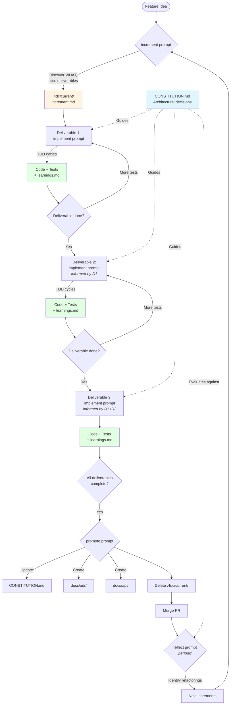

<p align="center">
  <picture>
    <source srcset="assets/4dc-logo-traced-dark.svg" media="(prefers-color-scheme: dark)">
    
  </picture>
</p>

<p align="center"><strong>4dc – four document cascade</strong></p>
<p align="center"><em>Discovery-driven prompts for emergent, test-driven development.</em></p>

---

> [!CAUTION]
> DO NOT TRUST AI, and do not trust others' prompts. Running prompts from untrusted sources is a security risk. Watch https://media.ccc.de/v/39c3-agentic-probllms

## Executive Summary

4dc is a set of **discovery-driven prompts** that help you build software through Socratic dialogue with an LLM. Instead of asking the AI to generate solutions, these prompts ask the right questions at the right time—helping you discover what to build, how to structure it, and where the design should emerge from test-driven development. You stay in control of every decision while the LLM acts as an experienced pair-programming partner.

The approach centers on **ephemeral working context** and **permanent project knowledge**. When you start a feature, increment artifacts (user stories, session notes, learnings) live in `.4dc/current/` as temporary scaffolding for the LLM. As you work through test-driven cycles, you discover architectural decisions, API contracts, and design patterns. Before merging, you promote important learnings to permanent documentation—`CONSTITUTION.md` for recurring decisions, ADRs for significant trade-offs, API contracts in `docs/api/`. After the merge, the increment context is deleted. Your repository contains only working code and the decisions that guide future work.

This workflow embodies **extreme programming principles**: small incremental changes, emergent design through refactoring, continuous testing, and working code as the source of truth. The prompts enforce discipline around these practices—slicing work into deliverables, writing tests first, challenging premature abstraction, capturing learnings—while keeping you in fast feedback loops. Design doesn't happen in a separate phase; it emerges from TDD cycles and gets refined as you learn.

Unlike traditional LLM workflows that generate complete solutions, 4dc helps you **think through problems systematically**. The constitution prompt helps you articulate your project's architectural constraints. The increment prompt helps you slice features into shippable deliverables. The implement prompt guides you through red-green-refactor cycles, questioning assumptions and suggesting refactorings. The promote prompt ensures valuable insights don't get lost when increment context is deleted. You learn to design well, not just to review AI-generated code.

---

## Installation

From the root of your project, run:

```bash
/bin/bash -c "$(curl -fsSL https://raw.githubusercontent.com/co0p/4dc/main/scripts/install-4dc-prompts.sh)"
```

This copies the prompt files into `.github/prompts/` with a `4dc-` prefix:

- `.github/prompts/4dc-constitution.prompt.md`
- `.github/prompts/4dc-increment.prompt.md`
- `.github/prompts/4dc-implement.prompt.md`
- `.github/prompts/4dc-promote.prompt.md`
- `.github/prompts/4dc-reflect.prompt.md`

It also creates the `.4dc/` working directory and adds it to `.gitignore`.

Reference these prompts in GitHub Copilot Chat, Cursor, or any LLM that supports prompt files.

---

## Quick Example

### 1. Create Your Constitution (One-Time Setup)

```bash
# Reference the constitution prompt and answer questions about your project
#4dc-constitution.prompt.md .
```

The LLM asks questions about your architectural decisions:
- "Where should domain logic live relative to UI code?"
- "How do you handle errors?"
- "What's your minimum testing expectation?"

You answer based on your project's reality. The result is `CONSTITUTION.md` with concrete decisions:

```markdown
# CONSTITUTION.md

## Layering
- Domain logic: `src/domain/`
- API routes: `src/api/`  
- Infrastructure: `src/infra/`

## Error Handling
- Domain returns `Result<T, Error>`
- API converts to HTTP status codes

## Testing
- Unit tests colocated with code
- Integration tests in `tests/integration/`
- All tests run in <10s locally
```

### 2. Start a Feature

```bash
# Create working context
mkdir -p .4dc/current

# Run increment prompt with your feature idea
#4dc-increment.prompt.md "add password reset"
```

The LLM asks discovery questions:
- "What's the smallest outcome that provides value?"
- "What's explicitly out of scope?"
- "How will you know it worked?"

Together you develop a user story, acceptance criteria, and slice the work into deliverables. The result is `.4dc/current/increment.md` (temporary LLM context).

### 3. Implement via TDD

```bash
# Run implement prompt
#4dc-implement.prompt.md
```

The LLM guides you through test-driven cycles:

```
LLM: "What's the first test for token generation?"
You: "Test that tokens are 32 bytes"
LLM: "Write a test that calls generate_token() and asserts length"

You: [writes test, runs it - fails]

LLM: "Good - failing for the right reason. What's the simplest 
      implementation that makes it pass?"
You: [implements, test passes]

LLM: "With tests green, what smells bad? Should we refactor?"
You: "The function name is unclear"
LLM: "What would be clearer?"
You: "generate_reset_token"
LLM: "Refactor the name, verify tests still pass"
```

As you work, the LLM appends important discoveries to `.4dc/current/learnings.md`.

### 4. Promote Learnings Before Merging

```bash
#4dc-promote.prompt.md
```

The LLM reads `.4dc/current/learnings.md` and asks what should be permanent:

```
LLM: "You discovered: 'Use SHA256 for tokens, bcrypt for passwords'
      Should this go in CONSTITUTION.md?"
You: "Yes"

LLM: [drafts addition to CONSTITUTION.md Security section]
     "Confirm?"
You: "Yes"

LLM: "You decided: 'Synchronous email delivery for v1'
      Should this be an ADR?"
You: "Yes"

LLM: [creates docs/adr/ADR-2025-01-26-sync-email.md]

LLM: "All learnings promoted. Ready to delete .4dc/current/?"
You: "Yes"
```

```bash
# Clean up and merge
rm -rf .4dc/current/
git add CONSTITUTION.md docs/ src/ tests/
git commit -m "Add password reset"
git push
```

---

## The Prompts

### constitution

**Purpose:** Discover and document your project's architectural decisions.

**When to use:** At project start, or when adopting 4dc. Re-run when you need to revisit foundational decisions.

**How it works:** The prompt asks concrete questions about how your specific project should be built—not abstract values or generic best practices. Where should layers be separated? How do you handle errors? What's your testing strategy? Where do artifacts live? You answer based on your project's size, team, constraints, and criticality. The LLM synthesizes your answers into `CONSTITUTION.md`.

**What it creates:** A lightweight, scannable document with concrete decisions: layering rules, error handling patterns, testing expectations, dependency management, artifact layout. This becomes the reference point for all other prompts. When the design prompt asks "where should this logic live?", it checks the constitution. When the implement prompt suggests tests, it aligns with your stated approach.

**What it does NOT create:** Abstract values ("we value quality"), comprehensive style guides (use linters for that), large ADRs (those are separate documents), or quality assessment lenses (those belong in the reflect prompt). The constitution is focused on decisions that guide daily work, not aspirations.

**Output:** `CONSTITUTION.md` (permanent, evolves with the project)

---

### increment

**Purpose:** Discover what to build by slicing a feature idea into small, shippable deliverables.

**When to use:** When starting new work—a feature, bug fix, refactoring, or exploration.

**How it works:** The prompt helps you turn a vague idea into a concrete plan through Socratic questioning. It asks about the problem, the desired outcome, who's affected, what success looks like, and what's explicitly out of scope. It challenges scope creep ("Is that required for this increment, or a follow-up?") and vague criteria ("What specific behavior tells you this worked?"). Together you develop a user story, acceptance criteria, and detailed use case.

**The key innovation:** After defining the overall increment, the prompt helps you slice it into **deliverables**—small, independently shippable pieces that each provide value or learning. For "add password reset", deliverables might be: (1) token generation, (2) email sending, (3) reset flow UI. Each deliverable goes through its own TDD cycle, and learnings from one inform the next. This enables emergent design instead of big design up front.

**What it creates:** `.4dc/current/increment.md` with user story, acceptance criteria, use case, and deliverable slices. This is temporary working context for the LLM—it helps the implement prompt understand what you're building. After merging, this file is deleted. Important insights get promoted to permanent docs.

**Output:** `.4dc/current/increment.md` (temporary, deleted after merge)

---

### implement

**Purpose:** Guide you through test-driven development cycles, one deliverable at a time.

**When to use:** After defining an increment, when you're ready to write code.

**How it works:** The prompt acts as a pair-programming navigator. It reads your constitution, the current increment context, and your existing code, then suggests the next smallest test to write. After you write a failing test, it asks: "Is this failing for the right reason?" "Is this the simplest test?" When you make it pass, it asks: "What's the simplest implementation?" "Are we solving just this test, or speculating about future needs?" During refactoring, it suggests improvements based on your constitution's principles.

**Design emerges through questioning:** Every 5-10 TDD cycles, the prompt asks: "Have we discovered anything that should be promoted?" If you found that bcrypt is too slow for tokens, it suggests adding that to learnings. If you discovered a new architectural pattern, it asks whether it should become a constitutional decision or an ADR. The code and tests ARE the design; the prompt helps you recognize when design insights should become permanent knowledge.

**Deliverable-by-deliverable flow:** The prompt works through one deliverable at a time. After completing deliverable 1 (token generation), it asks: "What did we learn that wasn't obvious?" before moving to deliverable 2 (email sending). This creates tight feedback loops—implementation experience shapes the next design decision.

**Output:** Working code + tests (permanent), `.4dc/current/notes.md` (session observations, temporary), `.4dc/current/learnings.md` (promotion candidates, temporary)

---

### promote

**Purpose:** Ensure important learnings become permanent documentation before deleting increment context.

**When to use:** Before merging a feature branch, after completing an increment.

**How it works:** The prompt reads `.4dc/current/learnings.md` (populated during implementation) and asks what should be promoted to permanent docs. For each learning, it asks: "Should this go in CONSTITUTION.md?" (affects future increments), "Should this be an ADR?" (non-obvious decision), "Should this be an API contract?" (public interface), or "Should this update README?" (changes project scope). You decide, and the LLM drafts the additions.

**Example promotions:** "Use SHA256 for tokens, bcrypt for passwords" → CONSTITUTION.md Security section. "Chose synchronous email delivery for v1" → new ADR explaining the trade-off. "POST /auth/reset-password endpoint" → OpenAPI spec in `docs/api/auth/`. "Add rate limiting" → backlog item (GitHub issue).

**After promotion:** The prompt confirms all learnings are captured, then asks: "Ready to delete `.4dc/current/`?" You confirm, delete the working context, and commit only the permanent additions (updated constitution, new ADRs, API contracts, code).

**Output:** Updates to `CONSTITUTION.md`, new files in `docs/adr/`, new files in `docs/api/`, backlog items (ephemeral context deleted)

---

### reflect

**Purpose:** Periodic codebase health check to identify refactoring opportunities.

**When to use:** After shipping several increments, when velocity slows, or when code feels painful.

**How it works:** The prompt guides you through systematic codebase assessment using **quality lenses**: naming clarity, modularity, architecture, testing, duplication, documentation, delivery flow, and dependency management. For each lens, it asks reflective questions: "Are names aligned with domain language?" "Can you change one component without touching many?" "Do tests give fast feedback?" You answer based on observed pain points and patterns.

**From assessment to action:** Rather than generating a report, the prompt helps you identify concrete refactorings. If validation logic appears in three places, it asks: "Should we consolidate this?" If error handling differs across modules, it asks: "Should we create a shared approach and document it as an ADR?" Each proposed refactoring is scoped small enough to become its own increment.

**Lenses are defined in this prompt:** Unlike the constitution (which captures your project's specific decisions), the lenses are general evaluation dimensions. They're tools for reflection, not rules for daily work. The reflect prompt applies these lenses to your codebase and constitution to surface improvement opportunities.

**Output:** Updates to `CONSTITUTION.md` (if patterns should become rules), new ADRs (if decisions need explanation), new increment ideas (for refactorings), backlog items (for future work)

---

## Repository Structure

```
my-project/
├── CONSTITUTION.md              # Permanent: architectural decisions
├── README.md                    # Permanent: project overview
│
├── docs/
│   ├── adr/                     # Permanent: decision records
│   │   ├── ADR-2025-01-20-use-postgres.md
│   │   └── ADR-2025-01-26-sync-email.md
│   ├── api/                     # Permanent: contracts, schemas
│   │   ├── README.md            # Versioning, evolution rules
│   │   └── auth/
│   │       └── password-reset.openapi.yaml
│   └── architecture/            # Permanent: diagrams (optional)
│       └── system-overview.mmd
│
├── src/                         # Permanent: code
├── tests/                       # Permanent: tests
│
└── .4dc/                        # Temporary: working context
    └── current/                 # Deleted after merge
        ├── increment.md         # What you're building
        ├── notes.md             # TDD session observations
        └── learnings.md         # Promotion candidates
```

**.gitignore:**
```
.4dc/
```

---

## What Lives Where

| Artifact | Location | Lifecycle | Purpose |
|----------|----------|-----------|---------|
| **CONSTITUTION.md** | Root | Permanent | Architectural decisions (layering, errors, testing, layout) |
| **README.md** | Root | Permanent | Project overview, setup, usage |
| **ADRs** | `docs/adr/` | Permanent | Decisions that need explanation (why X over Y) |
| **API Contracts** | `docs/api/` | Permanent | Public interfaces, OpenAPI specs, schemas |
| **Code + Tests** | `src/`, `tests/` | Permanent | The implementation (design lives here) |
| **Increment context** | `.4dc/current/increment.md` | Temporary | User story, deliverables (LLM context) |
| **Session notes** | `.4dc/current/notes.md` | Temporary | TDD observations, discoveries |
| **Learnings** | `.4dc/current/learnings.md` | Temporary | Promotion checklist |

**Key principle:** Increment artifacts are ephemeral scaffolding. After merge, only promoted decisions and working code remain.

---

## Workflow Diagram



---

## Why This Works

**Emergent design over big design up front:** Design decisions happen during TDD, not before. Each deliverable informs the next. You discover what's needed when you need it.

**Working code as truth:** The code and tests are the design. Documentation captures only the decisions that guide future work—why you chose X, how you handle Y, where Z should live.

**Fast feedback loops:** Deliverables are small (hours to days). You ship frequently, learn quickly, and adjust course based on real implementation experience.

**No stale documentation:** Increment context is deleted after merge. Only promoted learnings (constitution updates, ADRs, API contracts) remain. Your repo stays clean.

**LLM as navigator, not driver:** You make all decisions. The LLM asks questions that help you think clearly, challenges assumptions, and ensures discipline around TDD and refactoring.

**True extreme programming:** Small steps, continuous testing, emergent design, collective code ownership (via constitutional decisions), sustainable pace.

---

## Getting Started

1. **Install the prompts** (see Installation above)
2. **Create your constitution**: `#4dc-constitution.prompt.md .`
3. **Start your first increment**: `#4dc-increment.prompt.md "your feature idea"`
4. **Implement via TDD**: `#4dc-implement.prompt.md`
5. **Promote learnings before merge**: `#4dc-promote.prompt.md`
6. **Periodically reflect**: `#4dc-reflect.prompt.md` (after several increments)