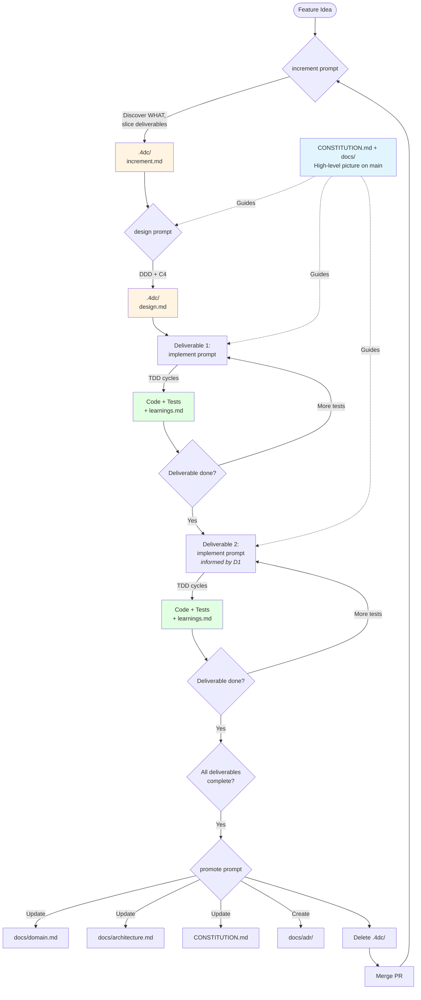

<p align="center">
  <picture>
    <source srcset="assets/4dc-logo-traced-dark.svg" media="(prefers-color-scheme: dark)">
    
  </picture>
</p>

<p align="center"><strong>4dc – four document cascade</strong></p>
<p align="center"><em>Discovery-driven prompts for emergent, test-driven development.</em></p>

---

> [!CAUTION]
> DO NOT TRUST AI, and do not trust others' prompts. Running prompts from untrusted sources is a security risk. Watch https://media.ccc.de/v/39c3-agentic-probllms

## Executive Summary

4dc is a set of **discovery-driven prompts** for building software through Socratic dialogue with an LLM. The prompts ask the right questions at the right time—helping you discover what to build and letting design emerge from TDD. You stay in control; the LLM acts as a pair-programming navigator.

**Ephemeral context, permanent knowledge.** Feature work lives in `.4dc/` as temporary scaffolding. Before merging, you promote learnings to permanent docs—`CONSTITUTION.md` for decisions, `docs/DESIGN.md` for emergent architecture, `docs/domain.md` for the domain model, `docs/architecture.md` for C4 diagrams, ADRs for trade-offs. After merge, increment context is deleted.

**Extreme programming principles:** small increments, emergent design, continuous testing, working code as truth. Design doesn't happen in a separate phase; it emerges from TDD cycles. Acceptance criteria carry inline greppable test names (`→ TestFeature_Given_When_Then`). Every deliverable starts with a walking skeleton and ATDD outer loop — acceptance tests written RED first, TDD inner loop drives them GREEN.

---

## Installation

From the root of your project, run:

```bash
/bin/bash -c "$(curl -fsSL https://raw.githubusercontent.com/co0p/4dc/main/scripts/install-4dc-prompts.sh)"
```

This copies the prompt files into `.github/prompts/` with a `4dc-` prefix:

- `.github/prompts/4dc-constitution.prompt.md`
- `.github/prompts/4dc-increment.prompt.md`
- `.github/prompts/4dc-design.prompt.md`
- `.github/prompts/4dc-implement.prompt.md`
- `.github/prompts/4dc-promote.prompt.md`

It also creates the `.4dc/` working directory and adds it to `.gitignore`.

Reference these prompts in GitHub Copilot Chat, Cursor, or any LLM that supports prompt files.

---

## Quick Example

### 1. Create Your Constitution (One-Time Setup)

```bash
# Reference the constitution prompt and answer questions about your project
#4dc-constitution.prompt.md .
```

The LLM asks questions about your architectural decisions:
- "Where should domain logic live relative to UI code?"
- "How do you handle errors?"
- "What's your minimum testing expectation?"

You answer based on your project's reality. The result is `CONSTITUTION.md` with concrete decisions:

```markdown
# CONSTITUTION.md

## Layering
- Domain logic: `src/domain/`
- API routes: `src/api/`  
- Infrastructure: `src/infra/`

## Error Handling
- Domain returns `Result<T, Error>`
- API converts to HTTP status codes

## Testing
- Unit tests colocated with code
- Integration tests in `tests/integration/`
- All tests run in <10s locally
```

### 2. Start an Increment

```bash
# Run increment prompt with explicit work type + intent
#4dc-increment.prompt.md "feature: add password reset"
```

The LLM asks discovery questions:
- "What's the smallest outcome that provides value?"
- "What's explicitly out of scope?"
- "How will you know it worked?"

Together you develop a user story, acceptance criteria (each with an inline greppable test name), and slice the work into deliverables. Deliverable 1 is always identified as a walking skeleton — the thinnest end-to-end path that proves all layers connect before logic is added.

The result is `.4dc/increment.md` (temporary LLM context):

```markdown
## Acceptance Criteria

- [ ] Given no tasks exist, when I run `todo add "Buy milk"`, then a task is stored
  → `TestAdd_GivenNoTasks_WhenAdd_ThenStoredWithDefaults`
- [ ] Given tasks exist, when I run `todo list`, then all tasks are printed
  → `TestList_GivenTasks_WhenList_ThenAllPrinted`
```

### 3. Shape Domain and Architecture

```bash
#4dc-design.prompt.md
```

The LLM guides a domain and architecture exploration before any code is written:

```
LLM: "What are the key domain concepts here? List them as nouns."
You: "Task, Priority, Status, Tag"

LLM: "What invariant does Task protect?"
You: "A task must always have a title and a status"

LLM: "Let's sketch the C4 context. Who interacts with the system?"
You: "Only the user, via CLI"
```

The result is `.4dc/design.md`—a shared vocabulary, DDD model, and C4 diagrams. Promoted excerpts become `docs/domain.md` and `docs/architecture.md`.

### 4. Implement via TDD

```bash
# Run implement prompt
#4dc-implement.prompt.md
```

The LLM starts each deliverable with a **technical kickoff** (API contracts, affected screens, data boundaries, first test seam), then drives an **ATDD outer loop**: acceptance tests — whose names come straight from `.4dc/increment.md` — are written first and stay RED until all criteria are met. The TDD inner loop then drives unit tests toward GREEN without per-step STOP gates.

```
LLM: "Write the acceptance test for TestAdd_GivenNoTasks_WhenAdd_ThenStoredWithDefaults first.
      It should compile and fail for the right reason."
You: [writes acceptance test, runs it — RED]

LLM: "Good — failing for the right reason. What's the first unit test
      that gets us one step closer?"
You: "Test that the CSV row is written"
LLM: "Write it. What's the simplest code that passes?"

You: [red → green → refactor cycles...]

LLM: "Acceptance test is GREEN. Deliverable done. What did we learn?"
```

As you work, the LLM appends important discoveries to `.4dc/learnings.md`.

### 5. Promote Learnings Before Merging

```bash
#4dc-promote.prompt.md
```

The LLM reads `.4dc/learnings.md` and pushes learnings back to the permanent high-level picture on main:

```
LLM: "You discovered: 'Use SHA256 for tokens, bcrypt for passwords'
      Should this go in CONSTITUTION.md?"
You: "Yes"

LLM: [drafts addition to CONSTITUTION.md Security section]
     "Confirm?"
You: "Yes"

LLM: "The Task aggregate boundary shifted—does docs/domain.md need updating?"
You: "Yes, Tag is now a value object on Task"

LLM: [drafts updated docs/domain.md]
     "Confirm?"
You: "Yes"

LLM: "All learnings promoted. Ready to delete `.4dc/`?"
You: "Yes"
```

```bash
# Clean up and merge
rm -rf .4dc/
git add CONSTITUTION.md docs/ src/ tests/
git commit -m "Add password reset"
git push
```

---

## The Prompts

### constitution

**Purpose:** Document your project's architectural decisions.

**When to use:** At project start, or when adopting 4dc.

**How it works:** Asks concrete questions: Where should layers be separated? How do you handle errors? What's your testing strategy? You answer based on your project's reality. The LLM synthesizes answers into `CONSTITUTION.md`.

**What it creates:** Layering rules, error handling patterns, testing expectations, artifact layout (including where `docs/DESIGN.md` lives and evolves). This becomes the reference for all other prompts.

**What it does NOT create:** Abstract values, style guides (use linters).

**Output:** `CONSTITUTION.md` (permanent, evolves with project)

---

### increment

**Purpose:** Slice a work item into shippable deliverables with testable acceptance criteria.

**When to use:** When starting new work—a feature, bug fix, refactoring, or exploration.

**How it works:** Asks discovery questions to understand the problem, then drives acceptance criteria that are observable and specific. Each criterion gets an inline greppable test name (`→ TestFeature_Given_When_Then`) added directly beneath it — no separate table. Guides identification of a **walking skeleton** as Deliverable 1: the thinnest end-to-end path that touches every architectural layer, proving they connect before any logic is added.

**Output:** `.4dc/increment.md` (temporary, deleted after merge)

---

### implement

**Purpose:** Guide TDD cycles, one deliverable at a time.

**When to use:** After the design phase (or after increment for trivial work), when ready to write code.

**How it works:** Starts with a **technical kickoff** for the current deliverable (API contracts, affected screens/states, data boundaries, first test seam). Then drives an **ATDD outer loop**: acceptance tests (from the inline `→ TestName` stubs in `increment.md`) are written first and run RED before any unit tests are written. The **TDD inner loop** then cycles freely — red → green → refactor — without per-step STOP gates. The acceptance test going GREEN marks the deliverable done. References `.4dc/design.md` for structural grounding. Flags design divergences immediately in `learnings.md`.

**Output:** Working code + tests (permanent), `.4dc/learnings.md` (promotion candidates, temporary)

---

### promote

**Purpose:** Push learnings back to the permanent high-level picture on main before merging.

**When to use:** Before merging, after completing an increment.

**How it works:** Reads `.4dc/learnings.md` and drives promotion decisions across all permanent knowledge stores:

| Learning Type | Destination |
|--------------|-------------|
| Domain model change | `docs/domain.md` |
| C4 architecture change | `docs/architecture.md` |
| Architectural decision | `CONSTITUTION.md` |
| Emergent design pattern | `docs/DESIGN.md` |
| Non-obvious trade-off | `docs/adr/` |
| Public interface | `docs/api/` |
| Future work | GitHub issue |

**After promotion:** Confirms all learnings captured, then: delete `.4dc/`, commit permanent additions, merge.

**Output:** Updates to `docs/domain.md`, `docs/architecture.md`, `CONSTITUTION.md`, `docs/DESIGN.md`, new ADRs, API contracts (ephemeral context deleted)

---

## Repository Structure

```
my-project/
├── CONSTITUTION.md              # Permanent: architectural decisions
├── README.md                    # Permanent: project overview
│
├── docs/
│   ├── domain.md                # Permanent: DDD model (language, contexts, aggregates, events)
│   ├── architecture.md          # Permanent: C4 diagrams (Mermaid)
│   ├── DESIGN.md                # Permanent: emergent architecture (what TDD discovered)
│   ├── adr/                     # Permanent: decision records
│   │   └── ADR-2025-01-26-sync-email.md
│   └── api/                     # Permanent: contracts, schemas
│       └── auth/
│           └── password-reset.openapi.yaml
│
├── src/                         # Permanent: code
├── tests/                       # Permanent: tests
│
└── .4dc/                        # Temporary: working context (deleted after merge)
    ├── increment.md             # What you're building + test stubs
    ├── design.md                # Domain model + C4 diagrams for this increment
    └── learnings.md             # Promotion candidates
```

**.gitignore:**
```
.4dc/
```

---

## What Lives Where

| Artifact | Location | Lifecycle | Purpose |
|----------|----------|-----------|---------|
| **CONSTITUTION.md** | Root | Permanent | Architectural decisions |
| **docs/domain.md** | `docs/` | Permanent | DDD model: language, contexts, aggregates, events |
| **docs/architecture.md** | `docs/` | Permanent | C4 diagrams: context, container, component |
| **docs/DESIGN.md** | `docs/` | Permanent | Emergent architecture (what TDD discovered) |
| **README.md** | Root | Permanent | Project overview |
| **ADRs** | `docs/adr/` | Permanent | Trade-off explanations |
| **API Contracts** | `docs/api/` | Permanent | Public interfaces |
| **Code + Tests** | `src/`, `tests/` | Permanent | The implementation |
| **Increment context** | `.4dc/increment.md` | Temporary | User story, ACs, test stubs |
| **Design context** | `.4dc/design.md` | Temporary | Domain model + C4 for this increment |
| **Learnings** | `.4dc/learnings.md` | Temporary | Promotion candidates |

**Key principle:** Increment artifacts are ephemeral. After merge, only promoted decisions and working code remain.

---

## Workflow Diagram


```mermaid
graph TB
    Start([Feature Idea])

    Constitution["CONSTITUTION.md + docs/\nHigh-level picture on main"]

    Start --> Inc{increment prompt}
    Inc -->|Discover WHAT,<br/>slice deliverables| IncDoc[.4dc/<br/>increment.md]

    IncDoc --> Design{design prompt}
    Design -->|DDD + C4| DesignDoc[.4dc/<br/>design.md]

    DesignDoc --> D1[Deliverable 1:<br/>implement prompt]
    D1 -->|TDD cycles| D1Code[Code + Tests<br/>+ learnings.md]
    D1Code --> D1Done{Deliverable done?}
    D1Done -->|More tests| D1
    D1Done -->|Yes| D2

    D2[Deliverable 2:<br/>implement prompt<br/><i>informed by D1</i>]
    D2 -->|TDD cycles| D2Code[Code + Tests<br/>+ learnings.md]
    D2Code --> D2Done{Deliverable done?}
    D2Done -->|More tests| D2
    D2Done -->|Yes| AllDone

    AllDone{All deliverables<br/>complete?}
    AllDone -->|Yes| Promote{promote prompt}
    Promote -->|Update| Domain[docs/domain.md]
    Promote -->|Update| Arch[docs/architecture.md]
    Promote -->|Update| ConstUpdate[CONSTITUTION.md]
    Promote -->|Create| ADR[docs/adr/]

    Promote --> Cleanup[Delete .4dc/]
    Cleanup --> Merge[Merge PR]
    Merge --> Inc

    Constitution -.->|Guides| Design
    Constitution -.->|Guides| D1
    Constitution -.->|Guides| D2

    style IncDoc fill:#fff4e1
    style DesignDoc fill:#fff4e1
    style D1Code fill:#e1ffe1
    style D2Code fill:#e1ffe1
    style Constitution fill:#e1f5ff
```

---

## Why This Works

**Emergent design:** Design happens during TDD, not before. Each deliverable informs the next.

**Working code as truth:** Code and tests are the design. Docs capture only decisions that guide future work.

**Fast feedback:** Deliverables are small (hours to days). Ship frequently, learn quickly.

**No stale docs:** Increment context deleted after merge. Only promoted learnings remain.

**Traceability:** Greppable test names map 1:1 to acceptance criteria. `docs/DESIGN.md` tracks what emerged.

**LLM as navigator:** You decide. The LLM questions, challenges, ensures TDD discipline.

---

## Getting Started

1. **Install the prompts** (see Installation above)
2. **Create your constitution**: `#4dc-constitution.prompt.md .`
3. **Start your first increment**: `#4dc-increment.prompt.md "feature: your feature idea"` — discover WHAT, define ACs with inline test names, identify walking skeleton
4. **Shape domain and architecture**: `#4dc-design.prompt.md` — shared vocabulary, DDD model, C4 diagrams
5. **Implement via TDD**: `#4dc-implement.prompt.md` — ATDD outer loop, then TDD inner loop, until acceptance tests pass
6. **Promote learnings before merge**: `#4dc-promote.prompt.md`

---

## Real-World Example: GoPomodoro

[**gopomodoro**](https://github.com/co0p/gopomodoro) is a minimal Pomodoro timer built using 4dc from scratch. It demonstrates how 4dc delivers on its promise of **emergent, test-driven development**.

### What You'll Find

The repository shows the complete artifact structure in action:

- **[CONSTITUTION.md](https://github.com/co0p/gopomodoro/blob/main/CONSTITUTION.md)** — Architectural decisions that emerged from concrete questions:
  - Package layout: Domain in `pkg/`, adapters in subpackages
  - Dependency inversion: Domain defines interfaces, adapters implement them
  - Construction patterns: Public fields over constructors (idiomatic Go)
  - Testing strategy: Black-box tests via `package <name>_test`

- **[DESIGN.md](https://github.com/co0p/gopomodoro/blob/main/DESIGN.md)** — Architecture that emerged from TDD:
  - Formatter pattern discovered while making tray UI testable
  - History table shows what emerged and when
  - Retrospective, not prescriptive

- **[Clean commit history](https://github.com/co0p/gopomodoro/commits/main)** — Each increment shows the cycle:
  - "first increment done" → Working feature
  - "Add short break and time display" → Next deliverable
  - "Refactor: rename Tick→AdvanceMinute" — Post-TDD cleanup

### Why This Proves 4dc Works

**1. Ephemeral context, permanent knowledge**
- No `.4dc/` directory in the repo (gitignored, deleted after merge)
- CONSTITUTION.md and `docs/DESIGN.md` contain only what matters
- Commit messages reflect completed work, not planning overhead

**2. Design emerged from TDD**
- Formatter pattern wasn't planned upfront—it emerged when testing UI
- Documented in `docs/DESIGN.md` only after discovery
- Package structure followed dependency inversion because tests demanded it

**3. Small, shippable increments**
- Each commit represents a complete deliverable
- Work progressed from state machine → breaks → UI → refactoring
- No half-implemented features or "WIP" branches

**4. Constitution guides, doesn't dictate**
- Clear rules: "Domain has zero imports", "No panics for expected failures"
- Concrete, testable decisions
- Evolved as the project learned (e.g., construction patterns added after discovering Go idioms)

**5. Working code as truth**
- Tests colocated with code (`*_test.go`)
- Black-box testing forces clean APIs
- No architectural diagrams—the code structure IS the architecture

### Start Your Own

Want to see the prompts that created this? Check the `.github/prompts/` directory in the 4dc repo, then install them in your project:

```bash
/bin/bash -c "$(curl -fsSL https://raw.githubusercontent.com/co0p/4dc/main/scripts/install-4dc-prompts.sh)"
```