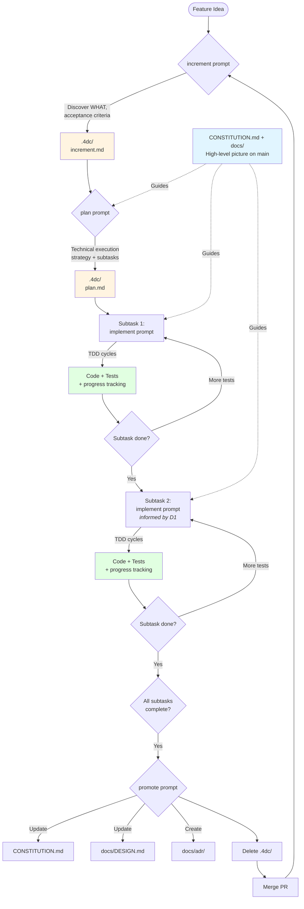

<p align="center">
  <picture>
    <source srcset="assets/4dc-logo-traced-dark.svg" media="(prefers-color-scheme: dark)">
    
  </picture>
</p>

<p align="center"><strong>4dc – four document cascade</strong></p>
<p align="center"><em>Discovery-driven prompts for emergent, test-driven development.</em></p>

---

> [!CAUTION]
> DO NOT TRUST AI, and do not trust others' prompts. Running prompts from untrusted sources is a security risk. Watch https://media.ccc.de/v/39c3-agentic-probllms

## Executive Summary

4dc is a set of **discovery-driven prompts** for building software through Socratic dialogue with an LLM. Each prompt takes on a specific role at the right moment—Principal Engineer to extract architectural decisions, Product-minded Engineer to slice work, Domain Architect to shape the design, TDD Navigator to drive implementation, and Documentation Steward to preserve learnings. You stay in control; the LLM asks the right questions, challenges vague answers, and keeps the work moving.

**Ephemeral context, permanent knowledge.** Feature work lives in `.4dc/` as temporary scaffolding. Before merging, you promote learnings to permanent docs—`CONSTITUTION.md` for decisions, `docs/DESIGN.md` for emergent patterns, ADRs for trade-offs, API specs for interfaces. After merge, increment context is deleted. All documents are generated as HTML for human reading and navigation.

**Extreme programming principles:** small increments, emergent design, continuous testing, working code as truth. Design doesn't happen in a separate phase; it emerges from TDD cycles and is captured when proven valuable. Acceptance criteria carry inline greppable test names (`→ TestFeature_Given_When_Then`). Implementation follows Red → Green → Refactor discipline with continuous progress tracking.

---

## Installation

From the root of your project, run:

```bash
/bin/bash -c "$(curl -fsSL https://raw.githubusercontent.com/co0p/4dc/main/scripts/install-4dc-prompts.sh)"
```

This copies the prompt files into `.github/prompts/` with a `4dc-` prefix:

- `.github/prompts/4dc-constitution.prompt.md`
- `.github/prompts/4dc-increment.prompt.md`
- `.github/prompts/4dc-plan.prompt.md`
- `.github/prompts/4dc-implement.prompt.md`
- `.github/prompts/4dc-promote.prompt.md`

It also creates the `.4dc/` working directory and adds it to `.gitignore`.

Reference these prompts in GitHub Copilot Chat, Cursor, or any LLM that supports prompt files.

---

## Quick Example

### 1. Create Your Constitution (One-Time Setup)

```bash
# Reference the constitution prompt and answer questions about your project
#4dc-constitution.prompt.md .
```

The LLM asks questions about your architectural decisions:
- "Where should domain logic live relative to UI code?"
- "How do you handle errors?"
- "What's your minimum testing expectation?"

You answer based on your project's reality. The result is `CONSTITUTION.md` with concrete decisions:

```markdown
# CONSTITUTION.md

## Layering
- Domain logic: `src/domain/`
- API routes: `src/api/`  
- Infrastructure: `src/infra/`

## Error Handling
- Domain returns `Result<T, Error>`
- API converts to HTTP status codes

## Testing
- Unit tests colocated with code
- Integration tests in `tests/integration/`
- All tests run in <10s locally
```

### 2. Start an Increment

```bash
# Run increment prompt with explicit work type + intent
#4dc-increment.prompt.md "feature: add password reset"
```

The LLM asks discovery questions:
- "Is this a feature, bugfix, refactor, or exploration?"
- "What exact behavior or outcome do you want?"
- "What problem are you trying to solve?"
- "What would success look like?"

Together you develop a user story and acceptance criteria (each with an inline greppable test name).

The result is `.4dc/increment.md` (temporary LLM context):

```markdown
## Acceptance Criteria

- [ ] Given no tasks exist, when I run `todo add "Buy milk"`, then a task is stored
  → `TestAdd_GivenNoTasks_WhenAdd_ThenStoredWithDefaults`
- [ ] Given tasks exist, when I run `todo list`, then all tasks are printed
  → `TestList_GivenTasks_WhenList_ThenAllPrinted`
```

### 3. Create the Plan

```bash
#4dc-plan.prompt.md
```

The LLM reads `CONSTITUTION.md` and `.4dc/increment.md`, then guides you through creating a concrete technical plan:

- **Technical approach** — how to deliver the increment safely
- **Constraints and dependencies** — what limits the solution space
- **Task breakdown** — ordered, actionable subtasks with verification points

Each decision is reviewed before moving forward.

The result is `.4dc/plan.md` — a concrete execution strategy for this increment, generated as HTML review first for approval.

### 4. Implement via TDD

```bash
# Run implement prompt
#4dc-implement.prompt.md
```

The LLM first creates `.4dc/implementation.md`—a detailed technical guide explaining what to change, where, and why for each file. You review and approve this document before any code is written.

Then execution begins in **Red → Green → Refactor** cycles:

```
LLM: [creates implementation.md with full technical guidance]
You: [reviews and approves]

LLM: [drafts first failing test]
You: [applies it, runs it — RED]

LLM: "RED for the right reason. Here's the simplest implementation:"
     [drafts minimal code]
You: [applies it, runs it — GREEN]

LLM: "GREEN. Refactor opportunity: the file path is hardcoded. Worth extracting?"
You: "Yes"

You: [red → green → refactor cycles...]

LLM: "Subtask complete. Progress updated in implementation.md."
```

Progress is tracked continuously. Decisions and lessons are recorded inline for promotion.

### 5. Promote Learnings Before Merging

```bash
#4dc-promote.prompt.md
```

The LLM reads all `.4dc/` artifacts and generates an HTML promotion report proposing where each learning should go:

```
LLM: "Found in implementation.md: 'Use SHA256 for tokens, bcrypt for passwords'
      Should this go in CONSTITUTION.md Security section?"
You: "Yes"

LLM: [drafts addition to CONSTITUTION.md]
     "Confirm?"
You: "Yes"

LLM: "New API endpoint documented. Add to docs/api/?"
You: "Yes, create OpenAPI spec"

LLM: [drafts docs/api/auth/tokens.openapi.yaml]
     "Confirm?"
You: "Yes"

LLM: "All learnings promoted. Cleanup summary ready. Delete `.4dc/`?"
You: "Yes"
```

```bash
# Clean up and merge
rm -rf .4dc/
git add CONSTITUTION.md docs/ src/ tests/
git commit -m "Add password reset"
git push
```

---

## The Prompts

### constitution

**Purpose:** Capture project guardrails and SDLC standards through focused discovery.

**When to use:** At project start, or when adopting 4dc.

**How it works:** Reads existing repository docs and structure, then asks 3-5 high-value questions per round about concrete, testable, project-specific decisions. Uses STOP gates—generates HTML review file in `.4dc/` for approval before writing final Markdown.

**What it creates:** Engineering principles (XP, lean, use-case thinking), architectural boundaries and dependency direction, testing strategy and quality gates, documentation rules and ADR policy, SDLC artifact expectations (OpenAPI specs, ADRs, visual design guide, personas, deployment strategy, testing decisions, observability, C4 diagrams).

**What it does NOT create:** Abstract values, style guides (use linters).

**Output:** `.4dc/constitution-review.html` (review), then `CONSTITUTION.md` (permanent, evolves with project)

---

### increment

**Purpose:** Define a narrow, testable changeset with clear WHAT and WHY for one increment.

**When to use:** When starting new work—a feature, bug fix, refactoring, or exploration.

**How it works:** Stays out of technical design and coding details. Keeps scope to one increment that can be completed in one focused cycle. Asks discovery questions to understand the problem, then drives acceptance criteria that are observable and specific. Each criterion gets an inline greppable test name (`→ TestFeature_Given_When_Then`) added directly beneath it. Uses STOP gates—generates HTML review file for approval before writing final Markdown.

**Output:** `.4dc/increment-review.html` (review), then `.4dc/increment.md` (temporary, deleted after merge)

---

### plan

**Purpose:** Convert increment intent into a concrete implementation strategy with ordered subtasks, sequencing, and verification points.

**When to use:** After increment, before implement — whenever you need to define HOW to deliver the increment safely.

**How it works:** Reads `CONSTITUTION.md` and `.4dc/increment.md`, then produces a technical execution plan. Keeps every task actionable, ordered, and verifiable. Does not start implementation in this phase. Uses STOP gates—generates HTML review file for approval before writing final Markdown.

**What it includes:** Technical approach summary, constraints and dependencies, task breakdown with explicit sequencing.

**Output:** `.4dc/plan-review.html` (review), then `.4dc/plan.md` (temporary, deleted after merge)

---

### implement

**Purpose:** Execute the approved plan with progress tracking and evidence.

**When to use:** After the plan phase, when ready to write code.

**How it works:** First creates a concrete technical implementation document (`.4dc/implementation.md`) explaining what to change, where, and why for each file-level change—like a senior engineer guiding a novice. Asks for verification before execution begins. Then executes each subtask in Red → Green → Refactor order. Does not write production code before the first failing test exists. Updates implementation status after each completed subtask. Records decisions and lessons immediately. Does not mark complete without test and verification evidence. Generates HTML progress reports.

**Output:** `.4dc/implementation.md` (detailed execution guide), working code + tests (permanent), promotion candidates documented inline

---

### promote

**Purpose:** Merge durable outcomes from the 4dc working set into permanent project artifacts before merge.

**When to use:** Before merging, after completing an increment.

**How it works:** Reviews all `.4dc` artifacts (increment.md, plan.md, implementation.md, promote.md). Presents each promotion candidate with destination and rationale. Requires explicit approval before writing permanent docs. Generates HTML promotion report for review.

| Learning Type | Destination |
|--------------|-------------|
| Architectural decision | `CONSTITUTION.md` |
| Design pattern | `docs/DESIGN.md` |
| Non-obvious trade-off | `docs/adr/` |
| Public interface | `docs/api/` (OpenAPI, schemas) |
| Testing strategy | Testing decisions docs |
| Observability changes | Observability docs |
| Deployment changes | Deployment strategy docs |
| Retrospective insight | `.4dc/promote.md` |

**After promotion:** Confirms all learnings captured, provides cleanup summary for `.4dc/`, then: delete `.4dc/`, commit permanent additions, merge.

**Output:** `.4dc/promotion-report.html` (review), updates to permanent docs, retrospective delta in `.4dc/promote.md`

---

## Repository Structure

```
my-project/
├── CONSTITUTION.md              # Permanent: architectural decisions and SDLC standards
├── README.md                    # Permanent: project overview
│
├── docs/
│   ├── DESIGN.md                # Permanent: emergent design patterns
│   ├── adr/                     # Permanent: decision records
│   │   └── ADR-2025-01-26-sync-email.md
│   └── api/                     # Permanent: contracts, schemas
│       └── auth/
│           └── password-reset.openapi.yaml
│
├── src/                         # Permanent: code
├── tests/                       # Permanent: tests
│
└── .4dc/                        # Temporary: working context (deleted after merge)
    ├── increment.md             # What you're building + acceptance criteria
    ├── plan.md                  # Technical execution strategy + subtasks
    ├── implementation.md        # Detailed step-by-step implementation guide
    └── promote.md               # Retrospective insights
```

**.gitignore:**
```
.4dc/
```

---

## What Lives Where

| Artifact | Location | Lifecycle | Purpose |
|----------|----------|-----------|---------|
| **CONSTITUTION.md** | Root | Permanent | Architectural decisions and SDLC standards |
| **docs/DESIGN.md** | `docs/` | Permanent | Emergent design patterns |
| **README.md** | Root | Permanent | Project overview |
| **ADRs** | `docs/adr/` | Permanent | Trade-off explanations |
| **API Contracts** | `docs/api/` | Permanent | OpenAPI specs, schemas |
| **Code + Tests** | `src/`, `tests/` | Permanent | The implementation |
| **Increment context** | `.4dc/increment.md` | Temporary | User story, acceptance criteria (HTML review) |
| **Plan context** | `.4dc/plan.md` | Temporary | Technical execution strategy + subtasks (HTML review) |
| **Implementation guide** | `.4dc/implementation.md` | Temporary | Detailed step-by-step implementation with progress tracking |
| **Retrospective** | `.4dc/promote.md` | Temporary | Promotion decisions and delivery insights |

**Key principle:** Increment artifacts are ephemeral. After merge, only promoted decisions and working code remain.

---

## Workflow Diagram


```mermaid
graph TB
    Start([Feature Idea])

    Constitution["CONSTITUTION.md + docs/\nHigh-level picture on main"]

    Start --> Inc{increment prompt}
    Inc -->|Discover WHAT,<br/>acceptance criteria| IncDoc[.4dc/<br/>increment.md]

    IncDoc --> Plan{plan prompt}
    Plan -->|Technical execution<br/>strategy + subtasks| PlanDoc[.4dc/<br/>plan.md]

    PlanDoc --> D1[Subtask 1:<br/>implement prompt]
    D1 -->|TDD cycles| D1Code[Code + Tests<br/>+ progress tracking]
    D1Code --> D1Done{Subtask done?}
    D1Done -->|More tests| D1
    D1Done -->|Yes| D2

    D2[Subtask 2:<br/>implement prompt<br/><i>informed by D1</i>]
    D2 -->|TDD cycles| D2Code[Code + Tests<br/>+ progress tracking]
    D2Code --> D2Done{Subtask done?}
    D2Done -->|More tests| D2
    D2Done -->|Yes| AllDone

    AllDone{All subtasks<br/>complete?}
    AllDone -->|Yes| Promote{promote prompt}
    Promote -->|Update| Constitution2[CONSTITUTION.md]
    Promote -->|Update| Design[docs/DESIGN.md]
    Promote -->|Create| ADR[docs/adr/]

    Promote --> Cleanup[Delete .4dc/]
    Cleanup --> Merge[Merge PR]
    Merge --> Inc

    Constitution -.->|Guides| Plan
    Constitution -.->|Guides| D1
    Constitution -.->|Guides| D2

    style IncDoc fill:#fff4e1
    style PlanDoc fill:#fff4e1
    style D1Code fill:#e1ffe1
    style D2Code fill:#e1ffe1
    style Constitution fill:#e1f5ff
```

---

## Why This Works

**Emergent design:** Design emerges during TDD and is captured in permanent docs only when it proves valuable.

**Working code as truth:** Code and tests are the primary artifacts. Docs capture only decisions that guide future work.

**Fast feedback:** Increments are small and focused. HTML reviews provide clear checkpoints before artifacts are written.

**No stale docs:** Increment context deleted after merge. Only promoted learnings remain.

**Traceability:** Each phase produces reviewable HTML before committing to Markdown. Implementation.md tracks progress continuously.

**LLM as guide:** You decide. The LLM questions, proposes, and ensures disciplined execution with explicit approval gates.

---

## Getting Started

1. **Install the prompts** (see Installation above)
2. **Create your constitution**: `#4dc-constitution.prompt.md .`
3. **Start your first increment**: `#4dc-increment.prompt.md "feature: your feature idea"` — discover WHAT, define acceptance criteria
4. **Create the plan**: `#4dc-plan.prompt.md` — technical execution strategy with ordered subtasks (HTML review for approval)
5. **Implement via TDD**: `#4dc-implement.prompt.md` — creates implementation.md guide, then Red → Green → Refactor cycles
6. **Promote learnings before merge**: `#4dc-promote.prompt.md` — HTML promotion report, update permanent docs, clean up `.4dc/`

---

## Real-World Example: GoPomodoro

[**gopomodoro**](https://github.com/co0p/gopomodoro) is a minimal Pomodoro timer built using 4dc from scratch. It demonstrates how 4dc delivers on its promise of **emergent, test-driven development**.