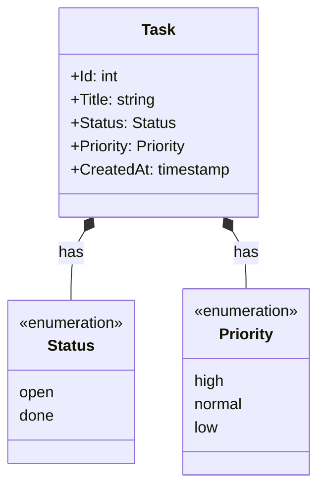
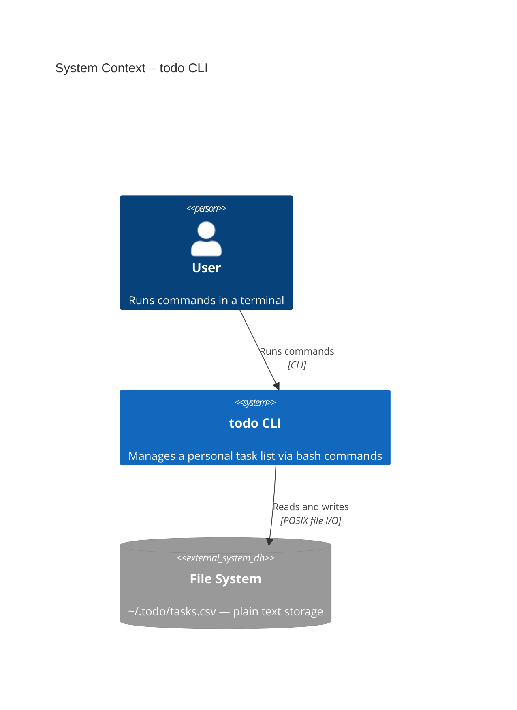
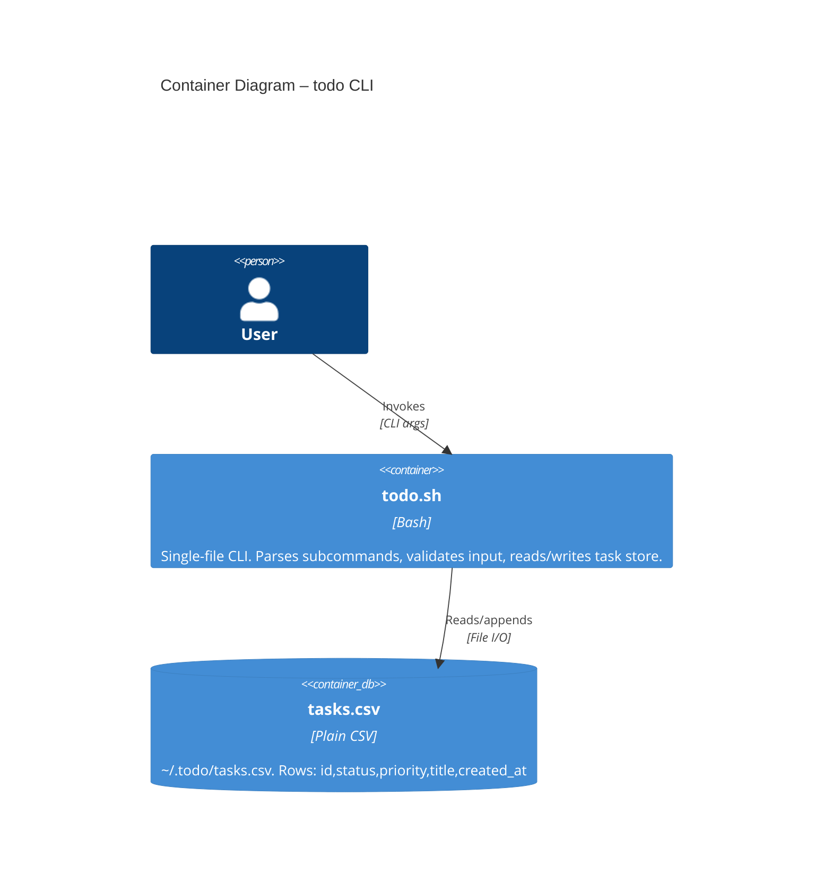
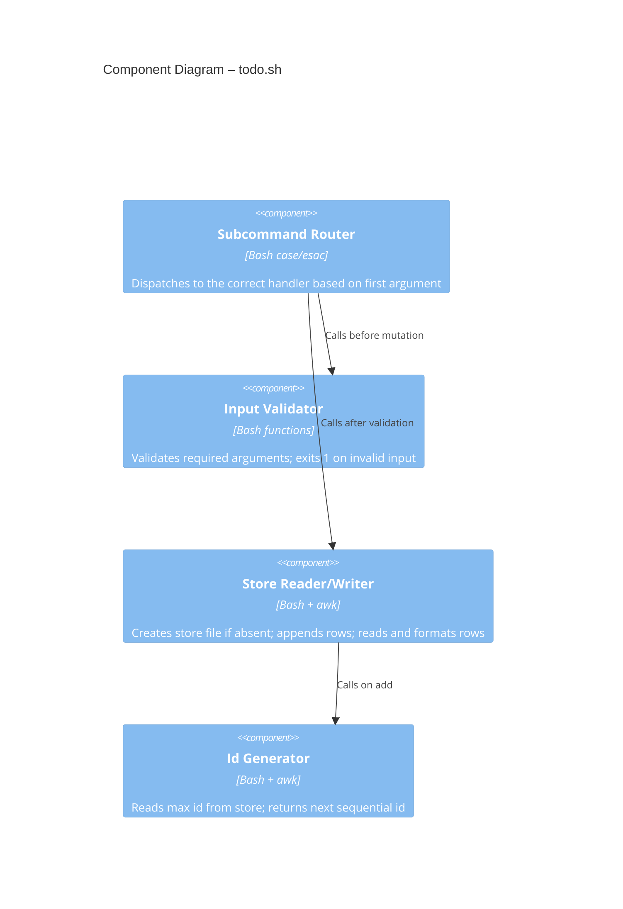

# Design: Add Task

> Ephemeral. Produced by the design phase. Deleted after merge.
> Promoted excerpts become `docs/domain.md` and `docs/architecture.md`.

---

## Ubiquitous Language

| Term | Definition | Notes |
|------|-----------|-------|
| Task | The central unit of work the user wants to track | Not called "todo" or "item" |
| Title | The human-readable description of a task | Required; cannot be empty |
| Status | The lifecycle state of a task | Values: `open`, `done` |
| Priority | The relative urgency of a task | Values: `high`, `normal`, `low` |
| Task Store | The file-backed persistence layer (`~/.todo/tasks.csv`) | Not a database; plain CSV |
| Id | A sequential integer uniquely identifying a task within the store | Assigned by the tool |

---

## Bounded Contexts

### Task Management
- **Responsibility:** Creating, reading, and mutating tasks. Owns the lifecycle of a Task.
- **Key concepts:** Task, Title, Status, Priority, Id, Task Store
- **Relationships:** Writes to and reads from the Task Store (infrastructure concern, same context for this scope)

> There is only one bounded context for this tool. No upstream/downstream relationship needed at this scope.

---

## Domain Model

### Aggregates
- **Task**: The root and only aggregate. Invariant: a Task must always have a non-empty Title and a valid Status. Id is assigned at creation and never changes.

### Value Objects
- **Status**: No identity. Compared by value. Two tasks with `open` have the same status meaning.
- **Priority**: No identity. Compared by value.

### Domain Events
- **TaskAdded**: Emitted when a new task is persisted. Carries: id, title, status, priority, created_at.

---

## C4 Architecture

### Context

### Container

### Component

---

## Design Decisions

### Decision: Single CSV file as task store
- **Decision:** Use a plain CSV file at `~/.todo/tasks.csv` as the only storage mechanism.
- **Rationale:** Aligns with CONSTITUTION.md (no external dependencies, human-readable). A new developer or user can inspect and edit the file directly.
- **Alternatives considered:** SQLite — rejected (requires sqlite3 binary); JSON — rejected (requires jq or complex awk).
- **Trade-offs accepted:** No atomic writes; no concurrent access safety. Acceptable for a single-user CLI.

### Decision: Sequential integer id
- **Decision:** Ids are sequential integers assigned by reading the highest existing id and incrementing.
- **Rationale:** Simple, predictable, and human-speakable ("fix task 3"). No uuid dependency.
- **Trade-offs accepted:** Gaps appear if rows are manually deleted from the CSV.

### Decision: Subcommand routing via case/esac
- **Decision:** The script uses a top-level `case $1 in` to dispatch subcommands.
- **Rationale:** Idiomatic bash. Easy to add new subcommands without touching existing ones.

---

## Open Questions

- [ ] Should `todo.sh list` sort by priority or by id (insertion order)?—watch during list deliverable
- [ ] Should `created_at` use a human-readable format or Unix epoch?—affects readability of the CSV
