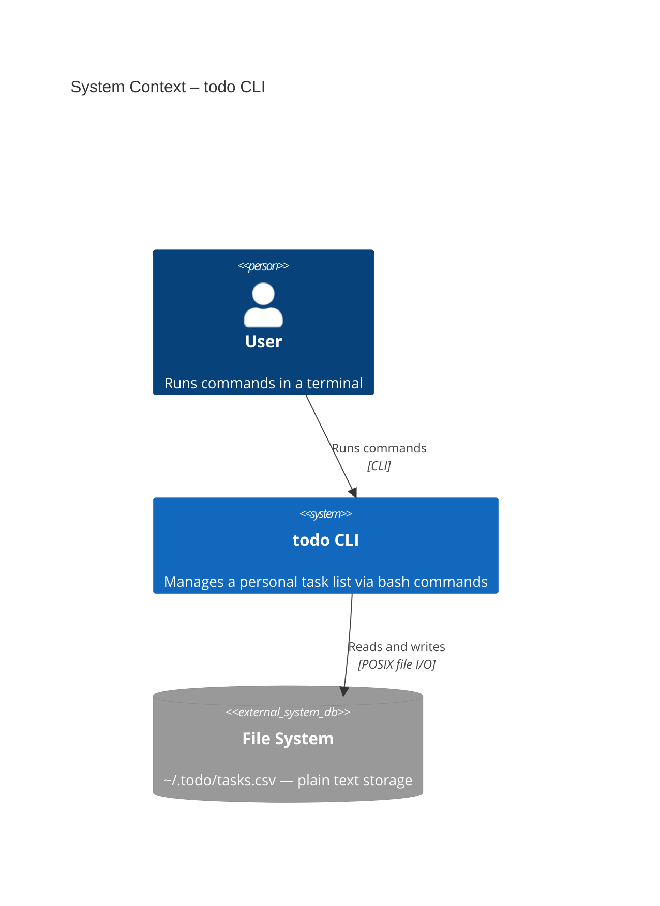
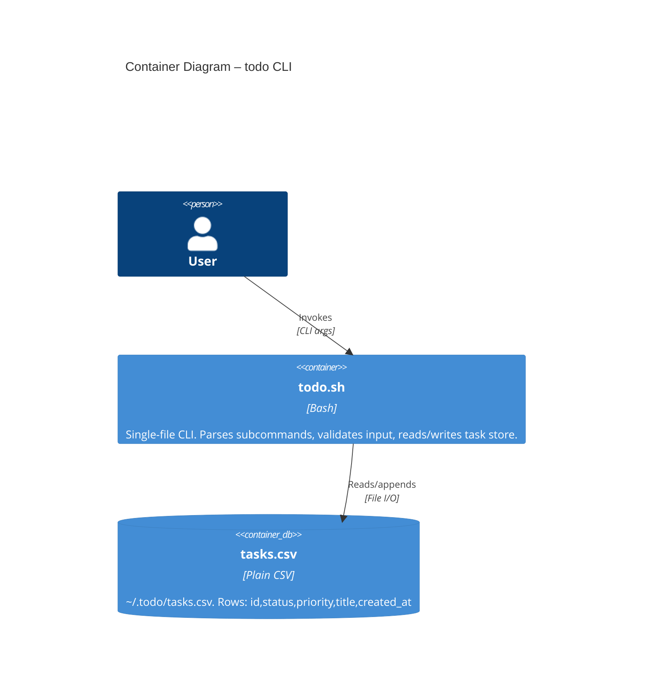
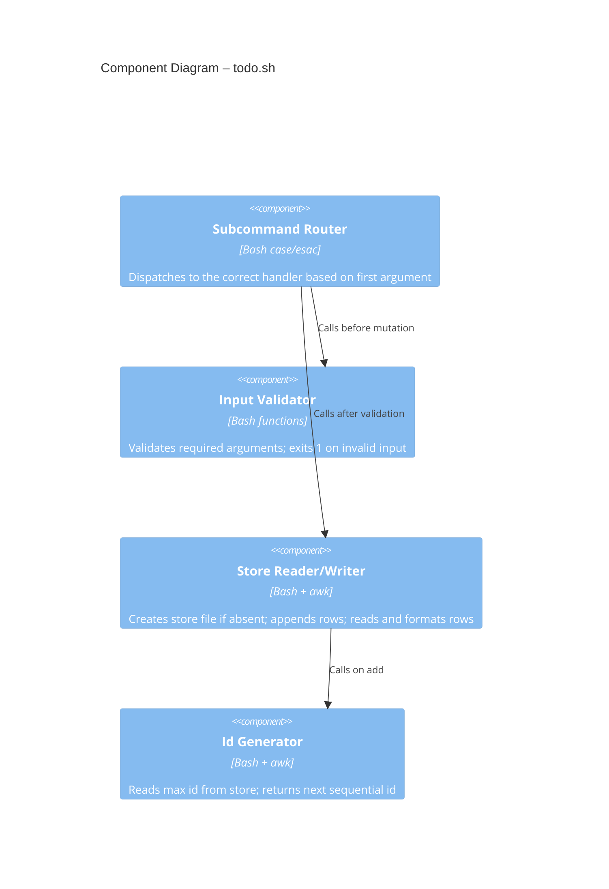

# Architecture

> Promoted from `.4dc/design.md` during the promote phase.
> Updated after each increment that changes the system structure.

---

## Context

---

## Container

---

## Component

---

## History

| Date | Increment | Changes |
|------|-----------|---------|
| 2026-03-27 | Add Task | Initial C4 diagrams: context, container, component |
