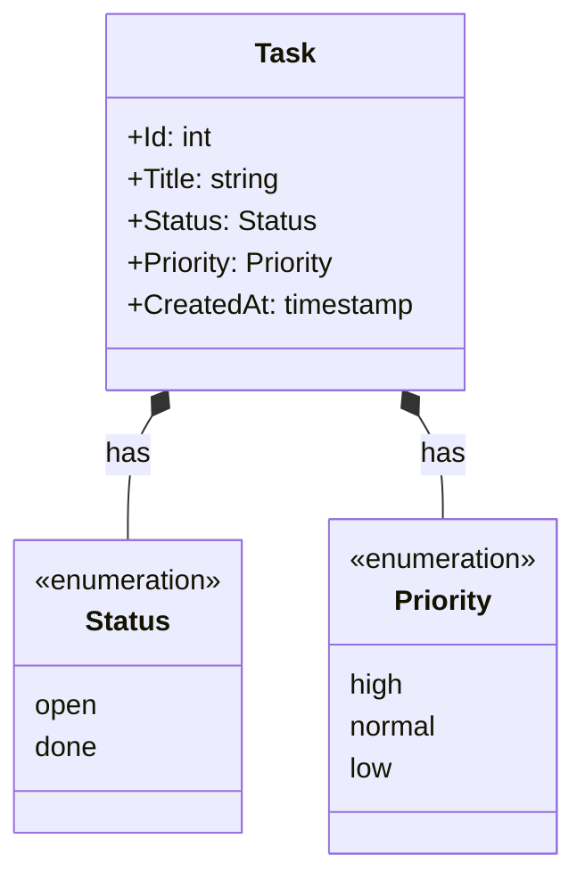

# Domain Model

> Promoted from `.4dc/design.md` during the promote phase.
> Updated after each increment that changes the domain.

---

## Ubiquitous Language

| Term | Definition | Notes |
|------|-----------|-------|
| Task | The central unit of work the user wants to track | Not called "todo" or "item" |
| Title | The human-readable description of a task | Required; cannot be empty |
| Status | The lifecycle state of a task | Values: `open`, `done` |
| Priority | The relative urgency of a task | Values: `high`, `normal`, `low` |
| Task Store | The file-backed persistence layer (`~/.todo/tasks.csv`) | Not a database; plain CSV |
| Id | A sequential integer uniquely identifying a task within the store | Assigned by the tool at creation |

---

## Bounded Contexts

### Task Management
- **Responsibility:** Creating, reading, and mutating tasks. Owns the full lifecycle of a Task.
- **Key concepts:** Task, Title, Status, Priority, Id, Task Store
- **Relationships:** Reads from and writes to the file system (infrastructure, same scope)

---

## Domain Model

### Aggregates

| Aggregate | Invariant |
|-----------|-----------|
| Task | Must always have a non-empty Title and a valid Status. Id is immutable after creation. |

### Value Objects

| Value Object | Why it is a VO |
|-------------|----------------|
| Status | No identity; compared by value. `open` means the same regardless of which task holds it. |
| Priority | No identity; compared by value. |

### Domain Events

| Event | Emitted When | Carries |
|-------|-------------|---------|
| TaskAdded | A new task is persisted | id, title, status, priority, created_at |

---

## History

| Date | Increment | Changes |
|------|-----------|---------|
| 2026-03-27 | Add Task | Initial model: Task aggregate, Status + Priority VOs, TaskAdded event |
